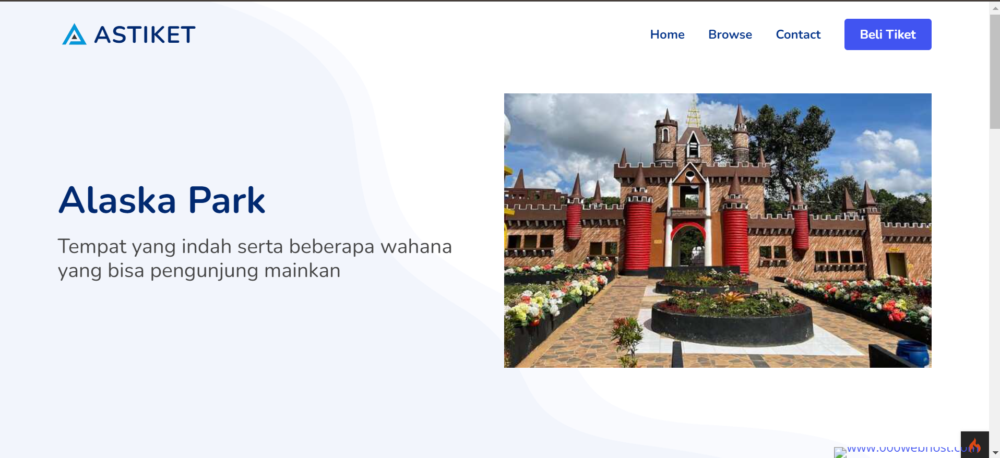
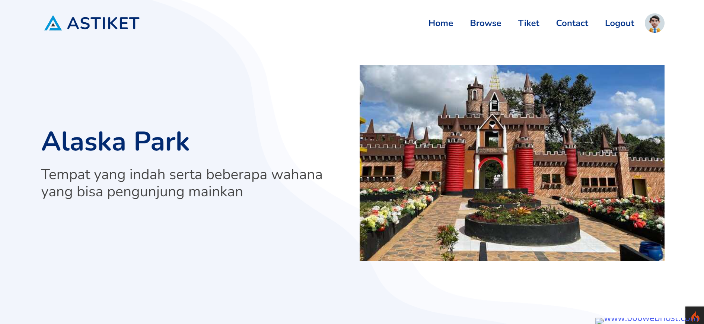
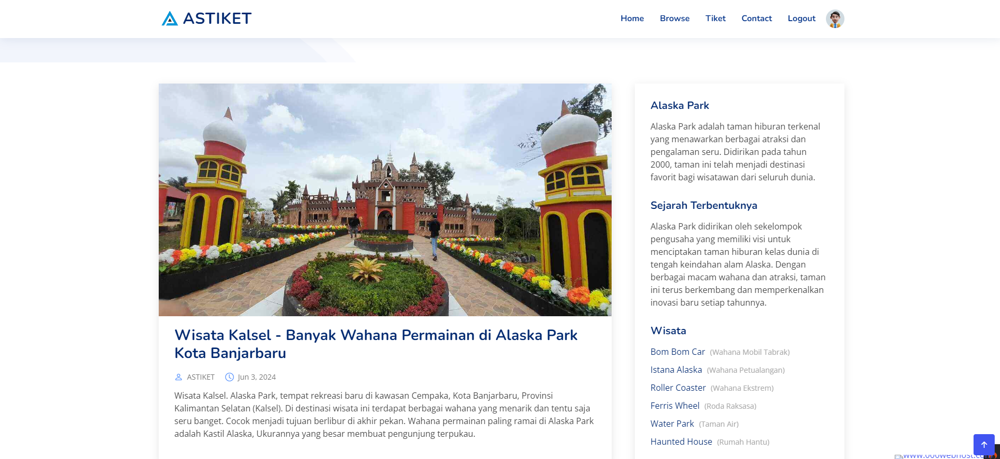
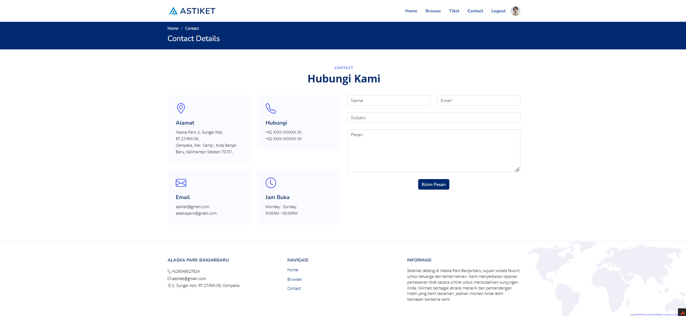
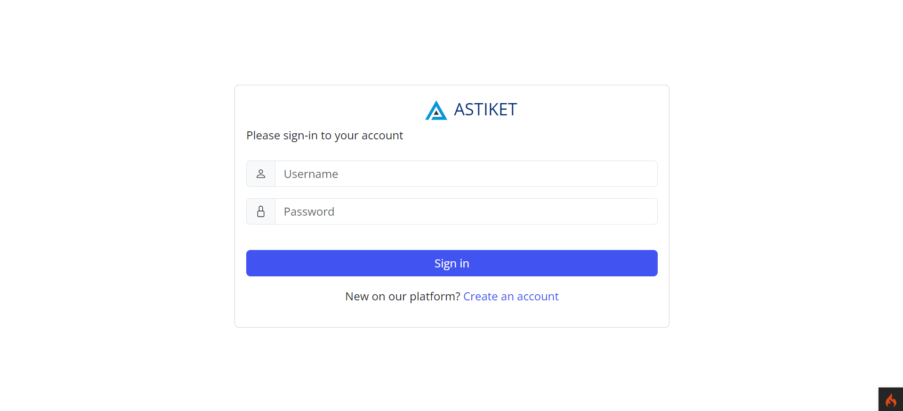
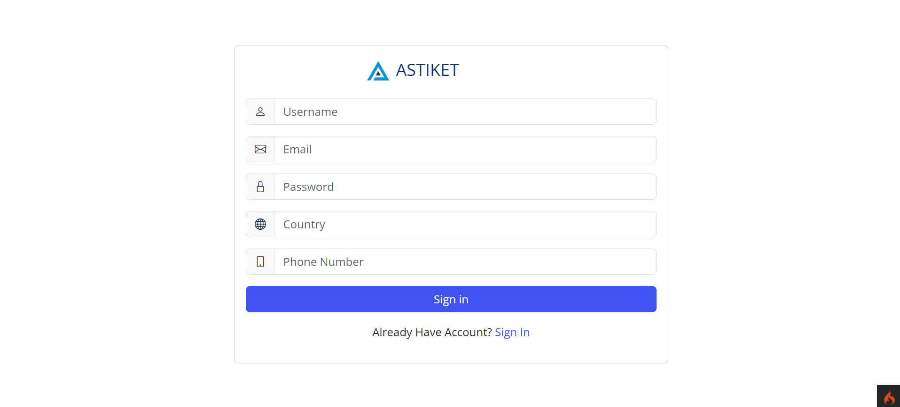
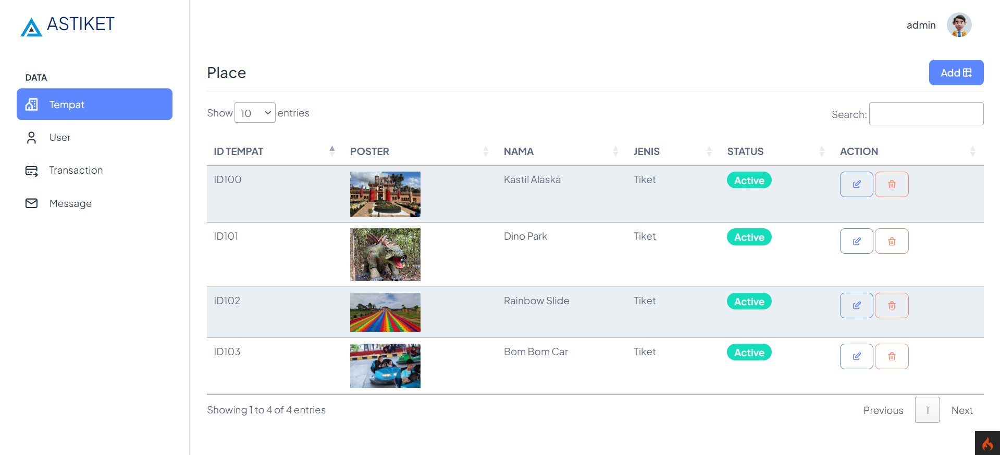
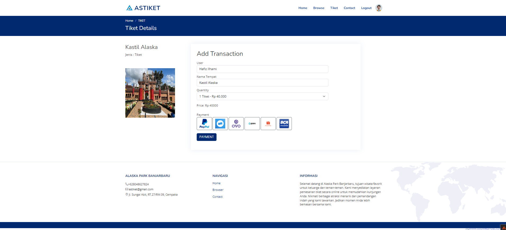

# ASTIKET

ASTIKET adalah aplikasi web yang dirancang untuk pemesanan tiket online di Alaska Park. Aplikasi ini memberikan solusi modern untuk memudahkan pengunjung dalam memesan tiket secara efisien dan cepat.

## Website Astiket
https://astiket.000webhostapp.com/

## Screenshots
- **Landingpage**
  
- **Home**
  
- **Browse**
  
- **Contact**
  
- **Login Page**
  
- **Register Page**
  
- **Dashboard**
  
- **Pemesanan Tiket**
  

## Fitur

- Responsive
- Otentikasi Login Pengguna
- Pendaftaran Tiket Baru
- Pembayaran Tiket
- Manajemen Pengguna
  - Admin
  - User
- Masuk Sebagai Admin
  username  : admin
  password  : admin123

## Resource yang Digunakan

Berikut adalah beberapa resource utama yang digunakan dalam pengembangan ASTIKET:

- **CodeIgniter 4** - Framework PHP untuk pengembangan aplikasi web.
- **Bootstrap** - Framework CSS untuk desain responsif.
- **Maps https://leafletjs.com/** - API untuk menampilkan maps.
- **TCPDF** - Library untuk mencetak tiket dan report.

## Prasyarat Instalasi

- XAMPP
- Git
- Composser

